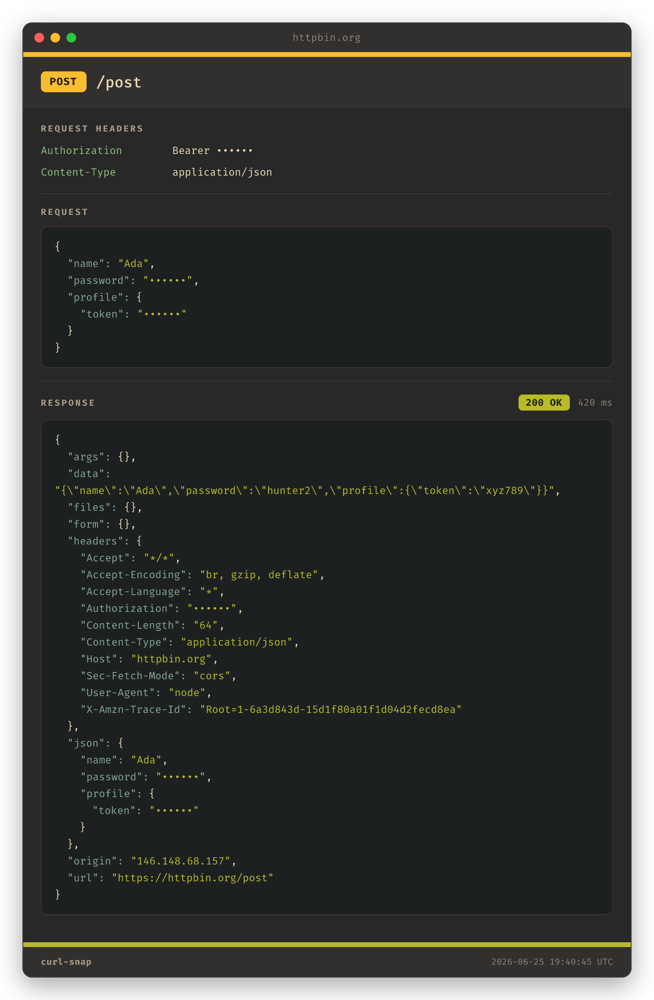

# curl-snap

[](https://www.npmjs.com/package/curl-snap)
[](https://nodejs.org)
[](LICENSE)

Turn a curl request into a clean PNG you can paste into a PR.

Every PR at work wants a screenshot proving the happy and sad paths of any
endpoint I touched. The usual move is to punch the payload into Swagger, run it,
and screenshot the result — except Swagger's UI is busy, off-brand, and clearly
not designed to be screenshotted. So I built a tiny tool that takes a curl
command, runs it, and renders a tidy little card of the request and response
instead. It even copies the image straight to your clipboard, so the whole loop
is: copy curl → `curl-snap` → paste into the PR.



It also redacts secrets by default, because pasting a live bearer token into a PR
is a great way to have a bad afternoon.

## Install

**npm** (it's a Node CLI, so this is the path of least resistance):

```sh
npm install -g curl-snap
```

**Homebrew** (macOS/Linux):

```sh
brew tap imatson9119/tap
brew install curl-snap
```

**From source:**

```sh
git clone https://github.com/imatson9119/curl-snap.git
cd curl-snap
npm install
npm link   # puts `curl-snap` on your PATH
```

You'll also need **Google Chrome** (or Chromium / Edge / Brave) installed —
curl-snap renders the card by screenshotting it with a headless browser. It does
*not* download one; it borrows the one you already have. Clipboard auto-copy
works out of the box on macOS, and on Linux if you have `xclip`.

## Quick start

```sh
# Paste a curl as an argument
curl-snap "curl -X POST https://api.example.com/users \
  -H 'Authorization: Bearer abc123' -H 'Content-Type: application/json' \
  -d '{\"name\":\"Ada\"}'"

# ...or pipe it in
pbpaste | curl-snap

# ...or copy a curl from anywhere and read it off the clipboard
curl-snap -c
```

Run `curl-snap` on its own and it just prints its description and version; add
`--help` for the full list of options.

By default you get the image **on your clipboard** (ready to paste) plus a quick
status/timing summary in the terminal — no file is written. Pass `--out` (or
`--out-dir`) when you actually want to keep a PNG on disk.

### Options

| Flag | What it does |
| --- | --- |
| `-o, --out <file>` | Save the PNG to this path (otherwise it's clipboard-only) |
| `--out-dir <dir>` | Save a timestamped PNG into this directory |
| `--copy` / `--no-copy` | Copy (or don't) the image to the clipboard |
| `--no-redact` | Show sensitive values (they're masked by default) |
| `--redact a,b` | Extra header/JSON keys to mask |
| `--reveal a,b` | Header/JSON keys to force-show |
| `--open` / `--no-open` | Open (or don't) the PNG after making it |
| `--width <px>` | Card width (default 760) |
| `--chrome <path>` | Point at a specific Chrome/Chromium binary |
| `-h, --help` | Help |
| `-V, --version` | Version |

## Verbosity

Low is the default — just the bodies, which is all most PRs need. Turn it up when
a reviewer wants receipts.

```sh
curl-snap '<curl>'              # low (default)
curl-snap '<curl>' -v           # medium
curl-snap '<curl>' -vv          # high
curl-snap '<curl>' --verbosity high
```

| Shows up on the card | low | medium | high | Toggle it directly |
| --- | :-: | :-: | :-: | --- |
| Request headers + request/response bodies | ✅ | ✅ | ✅ | (always on) |
| Response headers | | ✅ | ✅ | `--response-headers` / `--no-response-headers` |
| Response size, content-type, final URL | | ✅ | ✅ | `--response-meta` / `--no-response-meta` |
| Request size + content-type | | | ✅ | `--request-meta` / `--no-request-meta` |
| The reconstructed (redacted) source curl | | | ✅ | `--command` / `--no-command` |

The individual flags win over the level, so `-vv --no-command` means "everything,
but spare me the command block."

## Redacting secrets

On by default. Anything that looks sensitive gets swapped for `••••••`:

- **Headers** — `Authorization` (keeps the scheme: `Bearer ••••••`), `Cookie`,
  `Set-Cookie`, `X-Api-Key`, and any header whose name smells secret.
- **JSON keys**, recursively — `password`, `secret`, `token`, `api_key`,
  `access_token`, `client_secret`, `ssn`, `card`, `cvv`, and friends.
- **Form bodies** and **query params** with sensitive names.

Add your own with `--redact billing_id,internal_ref`, or pull something back into
the light with `--reveal token`. Want the unmasked version for a private doc?
`--no-redact`.

> One honest caveat: redaction is key-based. If a secret is buried *inside a
> string value* — say, an API that echoes your raw request body back as
> `"data": "...secret..."` — there's no key to match, so it won't get masked.
> Glance at the response before pasting if your API does that.

## Config

If you find yourself typing the same flags every time, don't. Drop a JSON config
somewhere and curl-snap will pick it up. Files are merged global → project →
`--config`, and explicit CLI flags still beat all of them:

1. `~/.config/curl-snap/config.json`
2. `~/.curl-snap.json`
3. `./.curl-snap.json` (project)
4. `./curl-snap.config.json` (project)
5. `--config <path>`

```sh
curl-snap --init-config        # scaffold ~/.config/curl-snap/config.json
curl-snap --print-config       # show what curl-snap actually resolved, and from where
curl-snap '<curl>' --no-config # ignore config for one run
```

A config is just the long-form of the flags:

```json
{
  "verbosity": "medium",
  "redact": true,
  "width": 820,
  "outDir": "./pr-evidence",
  "extraRedact": ["billing_id", "internal_ref"],
  "features": { "command": true }
}
```

`extraRedact` and `reveal` accumulate across config + CLI; `features` merges on top
of whatever the verbosity level set. `out` stays per-run — use `outDir` for a
default folder.

## What's on the card

- The method (color-coded), the path, and the domain in small, unemphasized text.
- A colored strip up top matching the method, and one along the bottom matching
  the response status — so you can tell a 200 from a 500 at a glance.
- Query parameters, pulled out of the URL into their own section so the route
  line stays readable (and sensitive ones get masked).
- Only the headers you actually set. curl's auto-added defaults never show up,
  because the card is built from your command, not from whatever went over the wire.
- Request and response bodies, with JSON pretty-printed and colorized.
- Empty sections (no headers, no body) just disappear.

The theme is [Gruvbox](https://github.com/morhetz/gruvbox), because it's easy on
the eyes and I like it.

## How it works

1. Parse the curl command into method / URL / headers / body.
2. Run it with Node's built-in `fetch` and capture the status, timing, and body.
3. Redact anything sensitive (for display only).
4. Render an HTML card and screenshot it with headless Chrome via `puppeteer-core`.
5. Copy the PNG to the clipboard (and save it to disk if you passed `--out`).

## Limitations

A few things I left out of v1, mostly on purpose:

- The request goes through `fetch`, not the real `curl` binary, using the parsed
  pieces of your command. Supported flags: `-X`, `-H`, `-d`/`--data*`/
  `--data-urlencode`, `--json`, `-u`, `-b`, `-A`, `-e`, `-G`, `-k`, `--url`, and a
  bare URL. Anything fancier (`-F` multipart, client certs, proxies) gets a
  warning, not a crash.
- One image per request. No combined happy+sad stacking yet.
- Clipboard auto-copy is macOS-first (Linux via `xclip`); elsewhere it just saves
  the file.

## Contributing

PRs welcome — see [CONTRIBUTING.md](CONTRIBUTING.md). It's a small codebase and
intentionally dependency-light.

## License

[MIT](LICENSE) © Ian Matson
